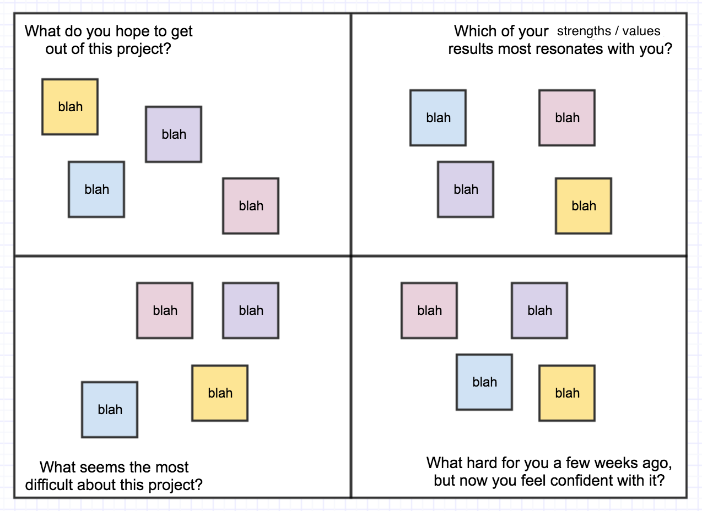

# Group setup

First, let's take a look at starting the project off with your group members in an effective manner:

# Bonus Calculator App

You are going to write a single JavaScript file to automatically calculate employee bonus for a company.

## Data Structure

The company is providing you with a few samples of employee data of how their data is currently being stored. Each are stored in a global array named `employees`.

### Employee Array
Each **Employee** currently is configured in this way:

* The `name` property holds the employees name.
* The `employeeNumber` property has their employee number.
* The `annualSalary` property contains their base annual salary.
* The `reviewRating` property contains their review rating.

## Processing Employee Bonuses

Loop over the `employees` array and do the following:

* use each employee object as the input to the function described below.
* `console.log` the results of each iteration.

## Function Logic

Write a declared function that takes in one **Employee** object (as an argument to the function), and returns a new **object** with the following properties:

* The `name` property should contain the employee's name.
* The `bonusPercentage` property should contain the bonus percentage the employee is to receive. See section below for calculation instructions.
* The `totalCompensation` property should be the adjusted annual compensation (base annual + bonus)
* The `totalBonus` should be the employee's total bonus rounded to the nearest dollar.

### Individual Bonus calculation
- Those who have a rating of a 2 or below should not receive a bonus.
- Those who have a rating of a 3 should receive a base bonus of 4% of their base annual income.
- Those who have a rating of a 4 should receive a base bonus of 6% of their base annual income.
- Those who have a rating of a 5 should receive a base bonus of 10% of their base annual income.
- If their employee number is 4 digits long, this means they have been with the company for longer than 15 years,
and should receive an additional 5%.
- However, if their annual income is greater than $65,000, they should have their bonus adjusted down 1%.
- No bonus can be above 13% or below 0% total.

NOTE: You may abstract out this bonus calculation into a second function if you like, but this is not mandatory.

## Stretch Goals
- Put the output on the DOM (visually on the page).
- Make the app run only after the user clicks on a button on the page
- Then style the output, making it visually appealing.
